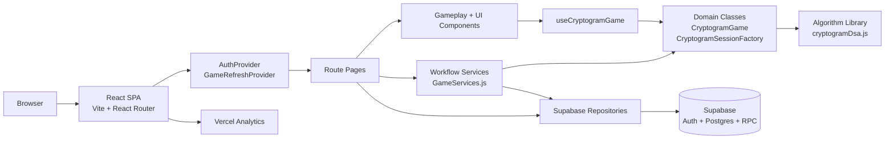
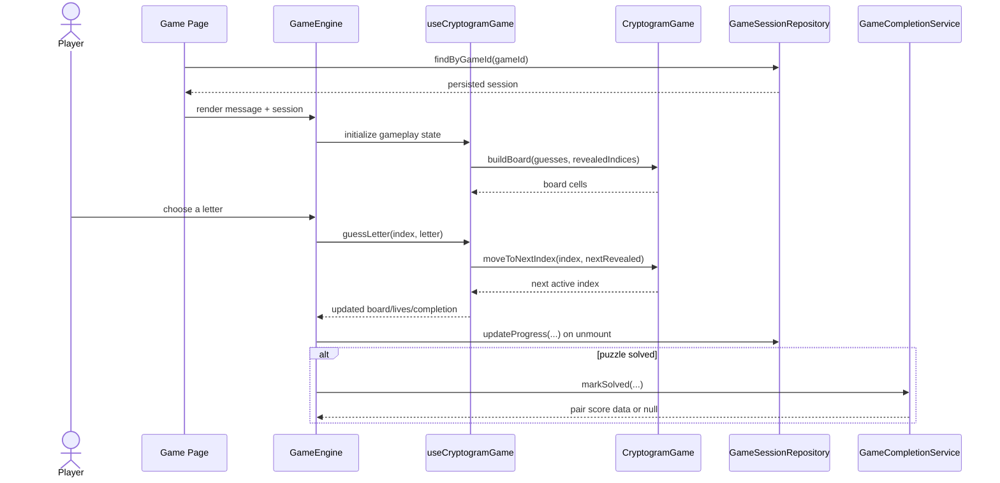

# Architecture And UML Diagrams

## System Architecture



## Gameplay Sequence



## UML Class Diagram

```mermaid
classDiagram
  class GameCreationService {
    +createFriendGame({senderId, receiverId, promptText}) Promise
  }

  class SinglePlayerGameService {
    +createOrFindGame(progress, userId) Promise
  }

  class DailyPuzzleService {
    +loadToday(user) Promise
    +recordLoss(userId, attemptsUsed) Promise
    +recordCompletion(userId, attemptsUsed, bestTimeSeconds) Promise
  }

  class GameCompletionService {
    +markSolved(options) Promise
    +closeFinishedGame(options) Promise
    +giveUp(gameId) Promise
  }

  class GameRepository {
    +findInProgressGame(gameId) Promise
    +countInProgressFromSenderToReceiver(senderId, receiverId) Promise
    +createSinglePlayerGame(promptId, difficulty) Promise
    +createNewGameViaRpc(payload) Promise
    +markSolved(gameId) Promise
    +markGaveUp(gameId) Promise
    +deleteGame(gameId) Promise
    +findPromptId(gameId) Promise
  }

  class GameSessionRepository {
    +findByGameId(gameId) Promise
    +findByMessageAndUser(message, userId) Promise
    +create(record) Promise
    +updateProgress(sessionId, userId, progress) Promise
    +reset(sessionId, resetSession) Promise
    +deleteBySessionId(sessionId) Promise
    +deleteByGameId(gameId) Promise
  }

  class CryptogramSessionFactory {
    +createFromPrompt(promptText, options) CryptogramSession
    +createDailySession(promptText, puzzleDate) CryptogramSession
    +createResetSession(existingSession, message) CryptogramSession
  }

  class CryptogramSession {
    +toDatabaseRecord(extraFields) Object
    +toHookState() Object
  }

  class CryptogramGame {
    +getLetterToIndices() Object
    +getCryptogramNumbers() Object
    +getTotalLetters() Number
    +buildBoard(guesses, revealedIndices) Array
    +getDisabledKeys(letterToIndices, revealedIndices) Set
    +getPartiallyRevealedKeys(letterToIndices, revealedIndices) Set
    +moveToNextIndex(currentIndex, revealedIndices) Number
    +chooseHintIndex(revealedIndices) Number
  }

  GameCreationService --> GameRepository
  GameCreationService --> CryptogramSessionFactory
  SinglePlayerGameService --> GameRepository
  SinglePlayerGameService --> GameSessionRepository
  SinglePlayerGameService --> CryptogramSessionFactory
  DailyPuzzleService --> CryptogramSessionFactory
  GameCompletionService --> GameRepository
  GameCompletionService --> GameSessionRepository
  CryptogramSessionFactory --> CryptogramSession
  CryptogramGame --> CryptogramSession
```
